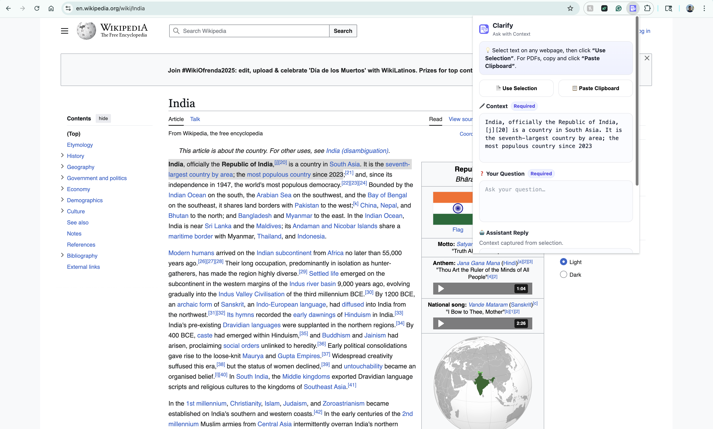
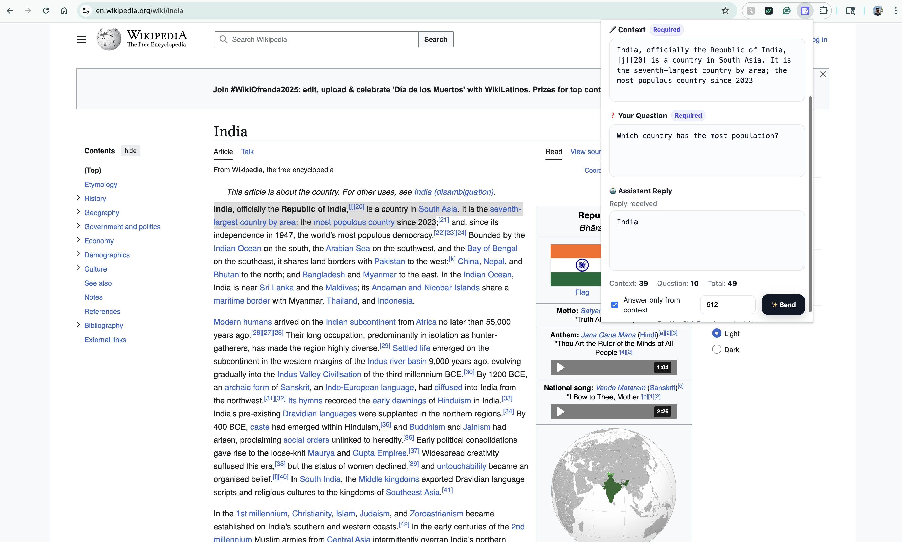

# 🧠 Clarify — Ask Smarter, Understand Faster

> Highlight text. Ask questions. Get answers that actually make sense.  
> Clarify turns any webpage or PDF into an instant Q&A experience — right where you’re reading.

<p align="center">
  
</p>
<p align="center">
  <a href="https://chromewebstore.google.com/detail/clarify/ponlkebhgnfclgedkhlgbjaphbldiahe" target="_blank">
    
  </a>
</p>


---

## 🚀 What is Clarify?

Clarify is a **Chrome extension** that lets you interact with any text on the web — articles, research papers, PDFs, or documentation — using AI.  
Just select the text, open Clarify, ask your question, and *boom 💥* — it gives you a context-aware answer, right inside your browser.

Built for readers, researchers, students, and the endlessly curious.  
Zero clutter. Zero trackers. Just *clarity.*

---

## ✨ Why Clarify is Awesome

- 🧩 **Context-Aware Answers** — It doesn’t just “guess”; it *reads* what you highlight and responds based on that context.
- 🔒 **Answer Only from Context (Strict Mode)** — Toggle this to force the AI to answer *only* from your selection — perfect for fact-checking, summarizing, or studying.
- 🎨 **Beautiful UI** — Minimal, modern popup with auto-growing text boxes, live token count, and smart design that feels good to use.
- ⚡ **Serverless Speed** — Powered by **Cloudflare Workers** for blazing-fast responses — no heavy servers, no downtime.
- 🧘 **Privacy-First by Design** — No accounts. No analytics. No cookies. Your text never leaves your browser except for your single AI query.
- 🧠 **Powered by OpenRouter’s GPT-5-Nano** — Light, fast, and contextual — everything you need for a quick, relevant answer.

---

## 🧰 How It Works (In Plain English)

1. You highlight or paste text → Clarify captures it.
2. You ask a question → Clarify sends it securely to its AI backend.
3. The backend (a Cloudflare Worker running OpenRouter’s GPT-5-Nano) does the magic.
4. You get a clear, concise, contextually correct response in seconds.

```bash
POST https://clarify.clarify-ai.workers.dev/chat
{
  "question": "Summarize this in one line.",
  "context": "The mitochondria is the powerhouse of the cell...",
  "fromContext": true
}
```
That's it. No data saved. No analytics. Just answers.

---

## ✨ How It Looks

Here’s Clarify in action — highlighting, asking, and answering right inside your browser:




---

## 💡 Features at a Glance

| Feature | Description |
|----------|-------------|
| 🔍 **Context-Aware AI** | Understands what you highlight before answering. |
| 🧾 **Paste from Clipboard** | Great for PDFs or sites where you can’t select text. |
| 🧠 **Strict Context Mode** | Forces AI to stay *within* the given text — no hallucinations. |
| 🎛 **Smart Tokens Panel** | Estimate and control your output length. |
| ⚙️ **Cloudflare Worker Backend** | Lightweight, reliable, and free-tier friendly. |
| 🛡 **Zero Tracking** | We never log, sell, or analyze your data — ever. |

---

## 🧩 Tech Stack

**Frontend:**  
- Chrome Extension (Manifest V3)  
- Vanilla JS + HTML + CSS  

**Backend:**  
- Cloudflare Workers (Serverless)  
- OpenRouter API (GPT-5-Nano for chat, OpenAI for embeddings)

**Tooling:**  
- Wrangler for Worker deployment  
- pnpm for package management  

---

## 🧱 Project Structure

```
pdf-reader/
├── extension/
│   ├── popup.html
│   ├── popup.js
│   ├── background.js
│   ├── content.js
│   ├── icons/
│   │   └── icon128.png
│   └── manifest.json
├── server/
│   └── src/
│       └── index.ts
├── workers/
│   └── src/
│       └── index.ts
└── README.md
```

---

## 🧠 Example Use Case

> You’re reading a Wikipedia article about Joan of Arc.  
> You highlight a paragraph describing her trial and click “Use Selection.”  
> Then you ask:  
> _“What was the main reason Joan was executed?”_  
>  
> **Clarify’s answer:**  
> “Joan was executed for heresy — mainly for claiming divine guidance, which the Church saw as blasphemy.”

Instant understanding. No tab-switching. No noise.

---

## 🛠 Setup for Developers

1. Clone this repo:  
   ```bash
   git clone https://github.com/your-username/clarify.git
   cd clarify/pdf-reader
   ```
2. Run the local server(optional testing):
    ```bash
    cd server && pnpm dev
    ```
3. Load the extension:
   - Go to `chrome://extensions`
   - Enable **Developer Mode**
   - Click **Load Unpacked**
   - Select the `/extension` folder

4. Done 🎉 — highlight text and start asking questions!

---

## ☁️ Deployment

Backend runs on Cloudflare Workers (free tier compatible):

```bash
cd workers
wrangler deploy
```
---

## 🔒 Privacy & Data

Clarify does **not**:
- Track users  
- Store data  
- Collect analytics  
- Share or log queries  

Every request is ephemeral — text is sent securely to the AI model and immediately discarded.

---

## 🧭 Roadmap

- [ ] Add dark mode 🌙  
- [ ] Support for more browsers 
- [ ] Context history viewer  
- [ ] Shortcut-based quick launch (Ctrl+Shift+C)  
- [ ] Multi-model support  

---

## 💬 Contributing

Got ideas to make Clarify even smarter or prettier?  
Fork this repo, open a PR, or share thoughts via Issues.  
All contributions welcome 💙

---

## 🧑‍💻 Author

Built with caffeine ☕ and curiosity 🧩 by **Suhaas Srungavarapu**

---

⭐ **If Clarify helped you understand something better — give it a star!**
